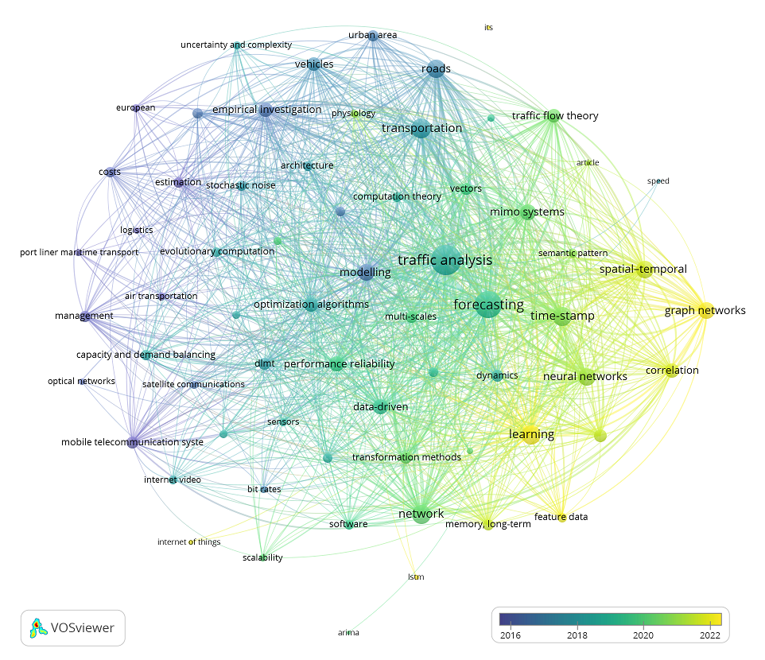

# Graph Structure Learning for Traffic Prediction

[](https://colab.research.google.com/github/mamintoosi/TGCN-GSL-PyTorch/blob/main/main-GCN-GSL-Colab.ipynb)
[](https://colab.research.google.com/github/mamintoosi/TGCN-GSL-PyTorch/blob/main/main-TGCN-GSL-Colab.ipynb)

This repository contains the official PyTorch implementation of the paper **"Graph Structure Learning for Traffic Prediction"**. We introduce a novel approach that enhances traffic forecasting by incorporating Graph Structure Learning (GSL) into two foundational architectures: the Graph Convolutional Network (GCN) [1] and its temporal extension T-GCN [2]. Rather than relying on predefined adjacency matrices based on physical proximity, our method learns the optimal graph structure directly from traffic data, significantly improving prediction accuracy.

## Key Features

- **Graph Structure Learning**: Automatic discovery of optimal graph adjacency matrices using the DAGMA algorithm
- **Multiple Architectures**: Implementations of GCN, T-GCN, and their GSL-enhanced variants (GCN-GSL, TGCN-GSL)
- **Flexible Prediction**: Support for multiple time horizons (1-4 steps ahead)
- **Comprehensive Evaluation**: Extensive experiments on two real-world traffic datasets
- **Reproducible Research**: Fully documented code with configuration files and Colab notebooks

## Table of Contents

- [Overview](#overview)
- [Repository Structure](#repository-structure)
- [Installation](#installation)
- [Datasets](#datasets)
- [Usage](#usage)
- [Graph Structure Learning](#graph-structure-learning)
- [Results](#results)
- [Bibliometric Analysis](#bibliometric-analysis)
- [Citation](#citation)
- [License](#license)

## Overview

Traditional graph-based methods for traffic prediction rely on predefined adjacency matrices constructed from spatial proximity. However, physical connections do not always reflect true functional traffic dependencies. Our approach addresses this limitation by learning the graph structure directly from traffic data using continuous optimization.

The key innovation is the integration of Graph Structure Learning (GSL) with GCN and T-GCN architectures, enabling the models to discover hidden, non-local dependencies between roads that would be missed by conventional approaches. This leads to both improved predictive performance and interpretable insights into traffic network dynamics.

## Repository Structure

```
TGCN-GSL-PyTorch/
├── configs/                 # YAML configuration files for all experiments
├── data/                    # Dataset files and precomputed adjacency matrices
├── models/                  # Model implementations (GCN, TGCN)
├── utils/                   # Utility functions and data loaders
├── main.py                  # Main training script
├── main-GCN-GSL-Colab.ipynb # Jupyter notebook for GCN experiments
├── main-TGCN-GSL-Colab.ipynb# Jupyter notebook for TGCN experiments
├── requirements.txt         # Python dependencies
└── vosviewer_keyword_mapper.py # Script for bibliometric analysis
```

## Installation

### Prerequisites

- Python 3.10 or higher
- CUDA-compatible GPU (optional, for faster training)

### Setup with Conda

We recommend creating a dedicated conda environment:

```bash
# Create and activate environment
conda create -n tgcn-gsl python=3.10
conda activate tgcn-gsl

# Install dependencies
pip install -r requirements.txt
```

### Requirements

Key dependencies include:
- numpy
- pandas
- torch (PyTorch 2.0+)
- torchmetrics>=0.11
- dagma (for Graph Structure Learning)

For a complete list with specific versions, see `requirements.txt`.

## Datasets

The repository includes support for two widely-used traffic datasets:

| Dataset | Description | Time Interval | Number of Sensors |
|---------|-------------|---------------|-------------------|
| **SZ-Taxi** | Taxi trajectory data from Shenzhen, China (Jan 2015) | 15 minutes | 156 |
| **Los-loop** | Loop detector data from Los Angeles County highways (Mar 2012) | 5 minutes | 207 |

Each dataset is split into training (80%) and testing (20%) sets while preserving temporal order to reflect real-world forecasting scenarios.

## Usage

### Running with Configuration Files

All experiments are controlled through YAML configuration files. To run a specific configuration:

```bash
python main.py --config configs/<configuration-file>.yaml
```

### Configuration Naming Convention

Files follow this naming pattern:
```
<model>-<dataset>-[gsl]-pre_len<prediction_length>.yaml
```

Where:
- `<model>`: `gcn` or `tgcn`
- `<dataset>`: `sz` (Shenzhen) or `los` (Los Angeles)
- `[gsl]`: Include `-gsl` to enable Graph Structure Learning
- `<prediction_length>`: Prediction horizon (1, 2, 3, or 4)

### Example Commands

```bash
# Run baseline GCN on Shenzhen dataset (prediction horizon 1)
python main.py --config configs/gcn-sz-pre_len1.yaml

# Run GCN with GSL on Shenzhen dataset (prediction horizon 1)
python main.py --config configs/gcn-sz-gsl-pre_len1.yaml

# Run TGCN with GSL on Los Angeles dataset (prediction horizon 3)
python main.py --config configs/tgcn-los-gsl-pre_len3.yaml
```

### Sample Configuration

```yaml
# gcn-sz-gsl-pre_len1.yaml
fit:
  trainer:
    max_epochs: 50
    accelerator: cuda
    devices: 1
  data:
    dataset_name: shenzhen
    batch_size: 64
    seq_len: 12
    pre_len: 1
  model:
    model:
      class_path: models.GCN
      init_args:
        hidden_dim: 100
        use_gsl: 1
    learning_rate: 0.001
    weight_decay: 0
    loss: mse
```

### Reproducing Paper Results with Colab

For convenience, we provide two Jupyter notebooks that automatically run all experiments from the paper:

1. **[GCN Experiments](https://colab.research.google.com/github/mamintoosi/TGCN-GSL-PyTorch/blob/main/main-GCN-GSL-Colab.ipynb)**: Runs all GCN configurations
2. **[TGCN Experiments](https://colab.research.google.com/github/mamintoosi/TGCN-GSL-PyTorch/blob/main/main-TGCN-GSL-Colab.ipynb)**: Runs all TGCN configurations

These notebooks can be run directly in Google Colab or any Jupyter environment with the required dependencies.

## Graph Structure Learning

Our implementation uses the DAGMA (Directed Acyclic Graph Matrix Estimation) algorithm [3] to learn the optimal graph structure from traffic data. The process works as follows:

1. **Automatic Loading**: If a precomputed adjacency matrix exists in the `data/` folder (e.g., `W_est_losloop_pre_len1.npy`), it is loaded automatically.
2. **On-the-fly Estimation**: If no precomputed matrix is found, the algorithm estimates one using GSL and saves it for future use.

Example output during estimation:
```
100%|██████████| 180000/180000.0 [10:03<00:00, 298.33it/s]
[2025-03-05 13:39:45,765 INFO] Using device: cuda
File data/W_est_losloop_pre_len1.npy did not exist. 
The adjacency matrix estimated by GSL is computed and saved.
```

## Results

Our experiments demonstrate consistent improvements across all prediction horizons and datasets:

| Model | Dataset | RMSE Improvement | MAE Improvement |
|-------|---------|------------------|-----------------|
| GCN-cGSL | SZ-Taxi | 21.6% | 30.3% |
| GCN-cGSL | Los-loop | 24.7% | 34.6% |
| TGCN-GSL | SZ-Taxi | 9.5% | 16.6% |
| TGCN-GSL | Los-loop | 21.8% | 30.5% |

Detailed quantitative results and analysis are available in the paper.

## Bibliometric Analysis

To contextualize our work within the broader research landscape, we conducted a bibliometric analysis of 784 traffic forecasting articles published between 2000 and 2025. The figure below shows a keyword co-occurrence network generated using semantic similarity grouping, with nodes colored by average publication year. This visualization reveals the recent surge in graph-based methods (nodes on the right), underscoring the timeliness and relevance of our approach.



*Figure: Clustered keyword co-occurrence network from 784 traffic forecasting articles. Nodes represent keyword clusters (minimum 10 occurrences), colored by average publication year. Graph-based methods (right nodes) represent the most recent methodological focus.*

The raw data for this analysis is available in `data/scopus.ris`, and the `vosviewer_keyword_mapper.py` script processes the keywords for visualization in VOSviewer.

## Citation

If you find this code or our paper useful for your research, please cite:

```bibtex
@article{amintoosi2026graph,
  title={Graph Structure Learning for Traffic Prediction},
  author={Amintoosi, Mahmood},
  journal={Submitted},
  year={2026}
}
```

For the preliminary conference version:

```bibtex
@inproceedings{amintoosi1403aimc55,
  title={Graph Structure Learning for Traffic Prediction: A Temporal Graph Convolutional Network Approach},
  author={Amintoosi, Mahmood},
  booktitle={Proceedings of the 55th Annual Iranian Mathematics Conference},
  year={2024}
}
```

## References

[1] Kipf, T. N., & Welling, M. (2017). Semi-Supervised Classification with Graph Convolutional Networks. *ICLR*. [arXiv:1609.02907](https://arxiv.org/abs/1609.02907)

[2] Zhao, L., et al. (2019). T-GCN: A Temporal Graph Convolutional Network for Traffic Prediction. *IEEE Transactions on Intelligent Transportation Systems*. [arXiv:1811.05320](https://arxiv.org/abs/1811.05320)

[3] Bello, K., et al. (2024). DAGMA: Learning DAGs via M-matrices and a Log-Determinant Acyclicity Characterization. *NeurIPS*. [arXiv:2209.08037](https://arxiv.org/abs/2209.08037)

## License

This project is licensed under the MIT License - see the [LICENSE](LICENSE) file for details.

## Contact

For questions or issues, please open an issue on GitHub or contact the author directly.

---

**Keywords**: Traffic Prediction, Graph Structure Learning, Graph Convolutional Networks, T-GCN, Spatio-Temporal Forecasting, Knowledge Discovery